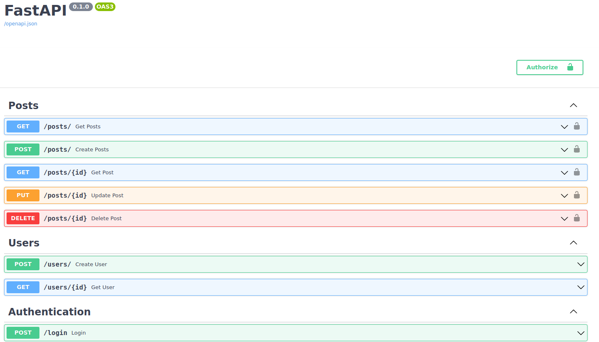

# python_api_development
Python API Development - side project

FastAPI server stood up w/ Heroku utilizing:
- alembic
- pydantic
- Oauth2
- Heroku AWS (SaaS)
- postgresql
- bcrypt
- uvicorn

## Preview of Heroku Instance
